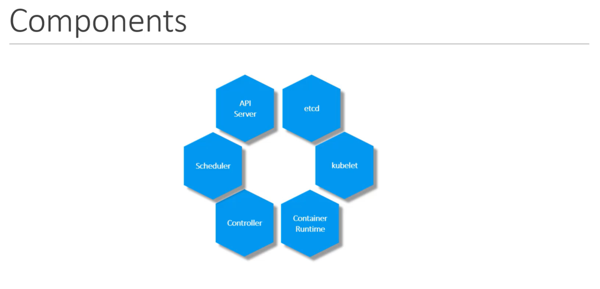
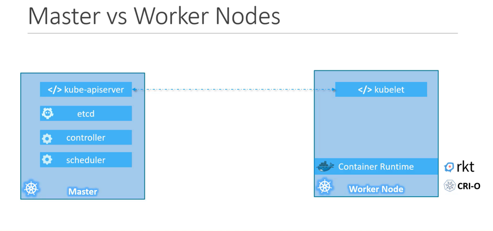

# Kubernetes Nodes, Clusters, and Master Components

## Nodes
A **node** is a physical or virtual machine where Kubernetes runs containers. Previously called "minions," nodes are the workhorses of your cluster. If a node fails, any containers running on it will go down—so multiple nodes are needed for high availability.

## Clusters
A **cluster** is a group of nodes managed together. If one node fails, your application can still run on the remaining nodes. Clusters provide both fault tolerance and load sharing. But who manages the cluster? That’s the job of the master components, which orchestrate and monitor the nodes.

## Master Components
When you install Kubernetes, several core components are set up:

- **API Server**: The main entry point for all Kubernetes commands. Users and tools interact with the cluster through the API server.
- **etcd**: A distributed, reliable key-value store that holds all cluster data, including configuration and state.
- **Scheduler**: Assigns newly created containers (pods) to nodes based on resource availability and policies.
- **Controllers**: Monitor the cluster state and make decisions to ensure the desired state is maintained (e.g., restarting failed pods).
- **Kubelet**: An agent running on each node, ensuring containers are running as expected.

### Visual Diagram


## Worker Node

A **worker node** hosts containers. Each worker node runs a **container runtime** (like Docker or containerd) and the **kubelet** agent, which reports node health and executes instructions from the master components.

## Master Node

The **master node** manages the cluster and runs these key components:
- **kube-apiserver**
- **etcd**
- **controller**
- **scheduler**

### Visual Diagram


## kubectl Command

`kubectl` is the command-line tool for interacting with a Kubernetes cluster. It lets you deploy applications, manage resources, and view logs.

**Basic usage:**
```sh
kubectl [command] [TYPE] [NAME] [flags]
```
- `command`: The action to perform (e.g., get, describe, create, delete)
- `TYPE`: The resource type (e.g., pods, deployments, services)
- `NAME`: The resource name (optional)
- `flags`: Additional options

**Examples:**
- List all pods:
    ```sh
    kubectl get pods
    ```
- Get details about a deployment:
    ```sh
    kubectl describe deployment my-deployment
    ```
- Apply a configuration file:
    ```sh
    kubectl apply -f config.yaml
    ```

**How kubectl works:**
- `kubectl` is a client that communicates with the Kubernetes API server on the control plane (master node).
- The API server processes your request (like creating a pod or fetching logs).
- The API server interacts with etcd or worker nodes as needed, then returns the result to `kubectl`.

**Example workflow:**
When you run:
```sh
kubectl get pods
```
- `kubectl` sends an HTTPS request to the API server.
- The API server checks the request and fetches data from etcd or worker nodes.
- The result is returned to you via `kubectl`.
